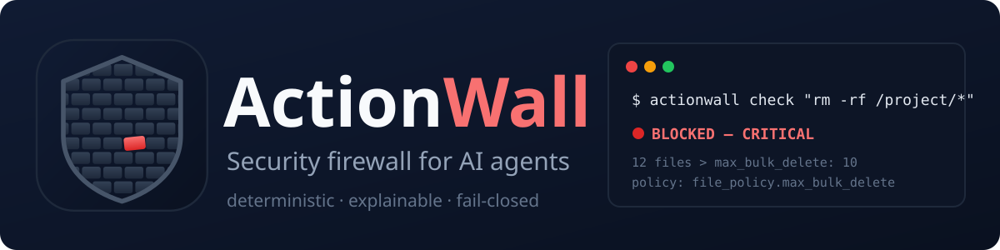

<p align="center">
  
</p>

**ActionWall is a policy firewall that sits between an AI agent and its tools.** Every tool call, shell command, file access and HTTP request an agent wants to make is inspected *before it runs* — scored against a YAML policy you control — and either **allowed**, **blocked**, or **escalated to a human**, with a tamper-evident audit log of everything.

```
   AI Agent
      ↓
  ActionWall
  ├── Tool permission check
  ├── Command risk analysis
  ├── Secret detection
  ├── URL / domain policy (incl. SSRF guard)
  ├── File access policy
  ├── Prompt-injection detection
  └── Action logging (hash-chained)
      ↓
  External tools / Internet
```

> **Why this exists:** agents can touch files, terminals, credentials and the internet. One compromised prompt or one over-eager tool call can delete a project, leak an API key, or fetch cloud instance metadata. ActionWall makes those failures *policy decisions*, not surprises.

---

## The 30-second demo

An agent wants to clean up its project directory:

```bash
$ actionwall check "rm -rf /project/*"
```

```
🔴 BLOCKED — Destructive filesystem operation
   Tool: shell · Agent: cli-agent · Risk: CRITICAL · 3.2ms
   Findings:
   🔴 [CMD-RM-BULK-DELETE] Destructive filesystem operation (commandRisk)
     rm would delete 12 files; policy allows at most 10 automatic deletions
     (file_policy.max_bulk_delete).
```

**Reason:** destructive filesystem operation. **Policy:** *the agent is not allowed to delete more than 10 files automatically* — the firewall actually counted the files the glob would remove before letting anything run.

See it live with a full scripted agent (9 actions — 3 allowed, 1 escalated to a human, 5 blocked):

```bash
npx tsx src/cli/index.ts demo     # or: npm run demo
```

---

## Quickstart

```bash
npm install
npm run build && npm test        # 76 tests
npx tsx src/cli/index.ts check "sudo chmod 777 /etc/hosts" --no-log
```

**Installation:** the project currently installs from source (clone → `npm install` → `npm run build`). An npm package release is planned — the package is already publish-ready (bin, exports, type declarations). See [docs/COMPARISON.md](docs/COMPARISON.md) for how ActionWall relates to Llama Guard, NeMo Guardrails, Agent-Wall and other tools in this space.

### Use it from Node

```ts
import { ShieldEngine, loadPolicy, makeAction, ActionBlockedError } from "./src/index.js";

const engine = new ShieldEngine(loadPolicy("policies/default.yaml"));

// Inspect and decide:
const decision = engine.check(
  makeAction({ tool: "shell", params: { command: "rm -rf build/*" }, agentId: "my-agent" })
);
if (decision.verdict === "BLOCK") console.log("⛔", decision.summary);

// Or throw-on-block integration for agent loops:
try {
  engine.guard(makeAction({ tool: "http.request", params: { url: "https://api.github.com" } }));
} catch (e) {
  if (e instanceof ActionBlockedError) console.log(e.decision.findings);
}
```

Every action is a plain object, so this wraps **any** agent framework — you call `engine.check()` (or the `guard()` convenience) right before your tool executor runs. See [examples/guarded-agent.ts](examples/guarded-agent.ts).

### CLI

| Command | Purpose |
|---|---|
| `actionwall check "cmd"` | Check a shell command (or a JSON action) against policy. Exit codes: `0` allow, `1` block, `3` ask-human, `2` error. |
| `actionwall validate --policy p.yaml` | Validate a policy file. |
| `actionwall log --last 10` | Show recent audit entries. |
| `actionwall log --verify` | Verify the audit log's SHA-256 hash chain. |
| `actionwall demo` | Run the scripted protected agent end-to-end. |

---

## What the scanners catch

| Scanner | Example catches | Default verdict |
|---|---|---|
| **Tool permissions** | tool on deny-list, deny-by-default allowlist violations | BLOCK / ASK |
| **Command risk** | `rm -rf /`, `curl … \| sh`, reverse shells, fork bombs, `dd of=/dev/…`, `sudo`, `env` dumps, `eval`, bulk deletes > limit | BLOCK / ASK |
| **File access policy** | reads of `.env` / `~/.ssh/**`, writes to `/etc/**`, deletions outside the workspace, path traversal, bulk deletion | BLOCK |
| **Secret detection** | AWS/GitHub/OpenAI/Stripe/Slack tokens, private keys, JWTs, credential assignments, high-entropy unknown tokens — always **redacted** in logs | BLOCK |
| **URL / domain policy** | cloud metadata endpoints (`169.254.169.254`), localhost/private ranges (SSRF), deny-listed or non-allow-listed domains, `file://` scheme | BLOCK |
| **Prompt injection** | "ignore previous instructions", fake system markers, role overrides, markdown-image exfiltration, hidden zero-width characters | ASK / BLOCK |

Verdicts come from policy thresholds (`HIGH/CRITICAL → BLOCK`, `MEDIUM → ASK_HUMAN` by default) and the engine is **fail-closed**: if a scanner itself crashes, the action is blocked.

## Policies

A policy is a small YAML file. Three presets ship in [`policies/`](policies/): `default.yaml` (balanced), `strict.yaml` (deny-by-default tools, egress allowlist), `readonly.yaml` (analysis agents that can't touch anything). Every field is documented in [docs/POLICY_REFERENCE.md](docs/POLICY_REFERENCE.md).

```yaml
version: 1
name: my-team-policy
risk_thresholds: { block: [HIGH, CRITICAL], ask: [MEDIUM] }
tools:
  default: deny
  allow: [file.read, file.write, shell]
file_policy:
  max_bulk_delete: 10
  protected_paths:
    - { path: "**/.env", permissions: [deny] }
url_policy:
  allowed_schemes: [https]
  block_private_networks: true
```

## Security model & limitations

Security claims should be specific, so here is the exact boundary (full detail in [docs/THREAT_MODEL.md](docs/THREAT_MODEL.md)):

**What ActionWall protects against**
- Destructive filesystem operations — measured, not guessed: the firewall counts what a delete would actually remove
- Reads/writes/deletes of protected paths (`.env`, SSH keys, `.git/**`, `/etc/**` …) and access outside the workspace
- Dangerous shell patterns: pipe-to-shell, reverse shells, privilege escalation, fork bombs, raw device writes, obfuscated execution
- Credentials leaving through tool arguments (signature + entropy detection, redacted everywhere)
- SSRF: cloud metadata endpoints and private-network targets
- Excessive tool agency: allow/deny lists, deny-by-default, per-agent policies
- Specific classes of prompt-injection-*induced* actions, and common injection patterns in tool output

**What it does not protect against**
- Every possible prompt-injection technique (paraphrased/multilingual attacks can pass heuristics — the action scanners are the hard control, not the text scanner)
- A compromised host or agent runtime (pair with containers/OS sandboxing — ActionWall is a policy gate, not isolation)
- Vulnerabilities in your dependencies or in your own policy misconfiguration
- TOCTOU races: ActionWall is a gate at decision time, not a transactional filesystem layer

## Audit log

Every decision is appended to `.actionwall/audit/audit-YYYY-MM-DD.jsonl` as a **hash-chained** record: each entry embeds the SHA-256 of the previous one, so editing or deleting history is detectable:

```
$ actionwall log --verify
✓ Chain intact — 13 entries verified in .actionwall/audit/audit-2026-09-14.jsonl
```

Secrets are redacted before anything hits disk.

## Documentation

| Doc | Contents |
|---|---|
| [docs/REQUIREMENTS.md](docs/REQUIREMENTS.md) | Functional & non-functional requirements (FR/NFR with acceptance criteria) |
| [docs/ARCHITECTURE.md](docs/ARCHITECTURE.md) | Pipeline design, scanner contract, design decisions, extension guide |
| [docs/THREAT_MODEL.md](docs/THREAT_MODEL.md) | STRIDE analysis, OWASP LLM Top-10 mapping, what's out of scope |
| [docs/COMPARISON.md](docs/COMPARISON.md) | Competitive landscape — how ActionWall differs from Llama Guard, NeMo Guardrails, Agent-Wall, sandboxes |
| [docs/POLICY_REFERENCE.md](docs/POLICY_REFERENCE.md) | Every policy field, with examples |
| [docs/ROADMAP.md](docs/ROADMAP.md) | What's next (MCP proxy, ML classifier, approvals workflow…) |

## Project layout

```
src/
├── core/        types, engine (decision pipeline), policy loader, audit log
├── scanners/    toolPermissions · commandRisk · filePolicy · secrets · urlPolicy · injection
├── cli/         check · validate · log · demo + report formatting
├── demo/        scripted mock agent used by `actionwall demo`
└── util/        safe shell tokenizer, bounded glob/FS counting, entropy, redaction
tests/           76 unit & integration tests (vitest)
examples/        demo-block-rm-rf.ts · guarded-agent.ts (integration pattern)
policies/        default · strict · readonly
```

## License

MIT — see [LICENSE](LICENSE).
